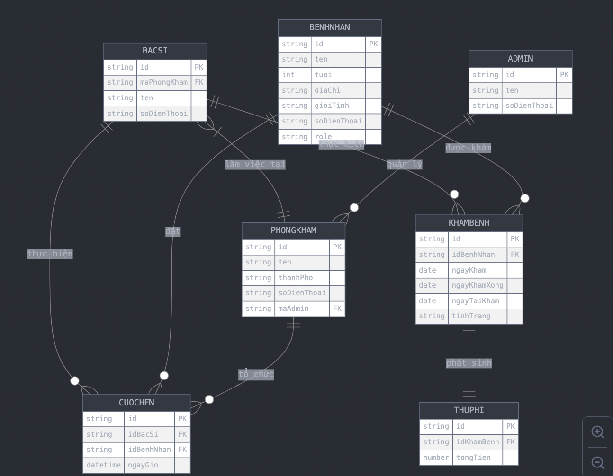
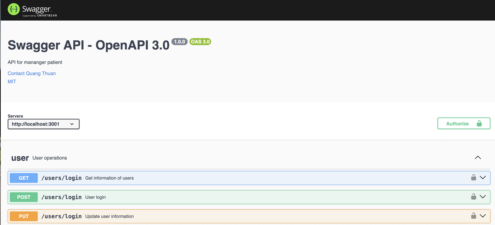

## Trần Quang Thuận
### Lời nói đầu
Đây là api dùng để quản lý danh sách bệnh nhân và bác sĩ tại bệnh viện
### công nghệ sử dụng
1. Backend: nodeJs(expressJs), mongoDB
2. Cloudinary, sử dụng rate limiting 

### Yêu cầu
1. Bổ sung thông tin trong file .evn

### cách chạy
1. mở terminal và [Clone](git@github.com:tranquangthuan1211/manager_patient_backend.git)
2. cd đến thư mục chứa dự án 
3. npm i hoặc yarn 
4. npm start để chạy api

### Lược đồ quan hệ

  

### Demo

  

**Lưu ý**: Đây là dự án cá nhân của mình và đang phát triển thêm và nó chỉ mang tính chất tham khảo.